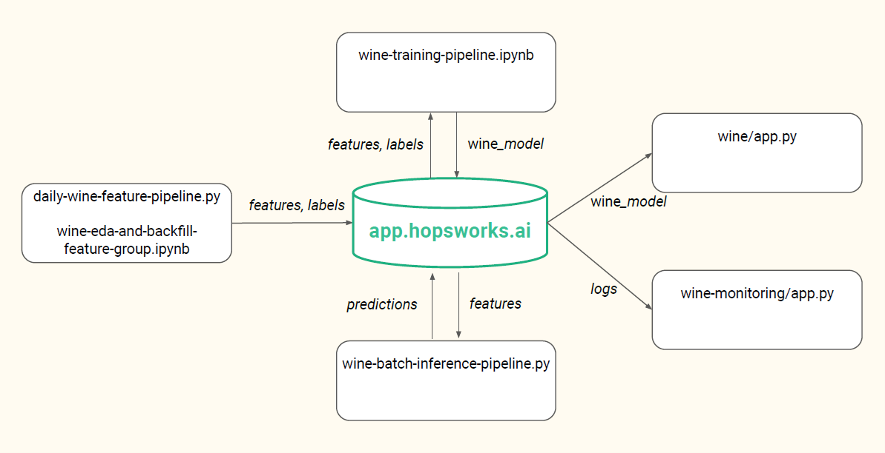

# Wine Quality Prediction

First Lab Assignment within the course ID2223 *Scalable Machine Learning and Deep Learning*

## Description of our Pipelines

In this Lab, we created a severless ML system for predicting the quality of wines and creating new wine samples
on a daily basis. 
An overview of the system can be seen in the image below:


We use Hopsworks to store two feature groups: *wine-enriched-balanced* which holds the features of the wine quality 
dataset and *quality predictions*, which stores the predicted wine qualities and is used for outcome monitoring. 
Furthermore, a model is registered on Hopsworks which we use for the classification task. 

To generate and evaluate new wine samples on a daily basis, we use GitHub Actions. 

Interactive apps that utilize the ML system are hosted on Hugging Face and use Gradio for the user interface.

[Hugging Face Wine Monitoring Space](https://huggingface.co/spaces/MarieGotthardt/wine_monitoring) \
[Hugging Face Wine Space](https://huggingface.co/spaces/MarieGotthardt/wine)


### Data Preparation and EDA
In a first step, we cleaned and prepared the data. First, we replaced missing data. 
In case of numerical features, we therefore randomly generated data points
within the range of the values of the respective features. For missing values of categorical data, 
on the other hand, we replaced missing data by a category corresponding to "Unknown". 
Afterwards, we checked the dataset for duplicated records and removed those. Then we transformed the 
categorical feature *type* into a numerical feature by using one-hot-encoding.

Furthermore, we re-categorized the target variable into categories from 0 to 4 (with a conceptual rating system of 1 to 
5 stars), with the following binning of the original 0-10 labelling scheme:

0-3: 0 (1 stars)  
4: 1  (2 stars)  
5: 2  (3 stars)  
6-7: 3  (4 stars)  
8-10: 4  (5 stars)  


After having the data prepared this way, we investigated the predictive power of the different features. 
Therefore, we examined the correlations between the features and dropped features that were
highly (>0.7) correlated with at least one other feature.

One problem we noticed during the EDA, was that there were only very few samples of certain target classes, i.e., the 
target classes were highly imbalanced. As we expected that this might have a negative effect on the classification
performance, we decided to perform data augmentation using the Synthetic Minority Over-sampling Technique (SMOTE).
This approach synthetically generates samples of the minor categories to achieve a balanced dataset. However, to avoid
having a uniform distribution after using SMOTE, we manually dropped some of the generated samples so that the resulting
distribution of the target variable would resemble the original distribution more closely. 


### Model Selection and Fine-Tuning
While this prediction task could have been modelled either as a regression or a classification problem, we decided to
treat it as a classification problem. 
For model selection, we conducted local experiments with XGBoost and Random Forest Classifier (RFC) and performed a grid search
for hyperparameter tuning. For XGBoost, we performed the grid search over the hyperparameters *maximum depth*, *learning rate*
and *subsample* while for the RFC we performed the grid search over the hyperparameters *maximum features* and *maximum depth*.
To compare model performance, we used the metrics *accuracy* and *ROC AUC*.
Eventually, we decided to use the XGBoost model for the hopsworks model as it showed a slightly better performance in both
metrics after hyperparameter tuning than the RFC. 


### Data Sampling
For sampling a new synthetic wine, red or white is chosen randomly with equal probability as the wine type. 
A Gaussian Mixture Model (GMM) is then fit to the data for the chosen wine type, and a single sample is then taken from 
the GMM and put in a dataframe. The quality label is included in the GMM but is then rounded and cast to an int to fit 
the quality label classes.


### Classification Results
To get a realistic assessment of the classification performance of our XGBoost classifier on the original wine data, we test it on
a 10% holdout set from the original data. The other 90% of the data is expanded with SMOTE and then adjusted in terms of class distributions.
This is demonstrated in the following Jupyter Notebook: [SMOTEbook](https://github.com/MarieGotthardt/id2223-lab1/blob/main/local_experiments/smotebook.ipynb)

An example run of this notebook gives the following results:

```
Accuracy before SMOTE:
XGBoost accuracy: 0.6941838649155723

Accuracy when trained on SMOTE data:
XGBoost accuracy: 0.6697936210131332

Accuracy when trained on adjusted SMOTE data:
XGBoost accuracy: 0.6848030018761726
```

As can be seen, the highest accuracy is achieved when just training on the original data. When trained on SMOTE data, where class labels are completely even in terms of class distribution, the accuracy is lower likely due to the model now over-predicting infrequent classes in the original data. After adjusting the SMOTE data to move the class distribution slightly closer to the original distribution; the accuracy goes up and is now closer to the accuracy possible when training on just original data.


### Discussion of our Approach
Using Hopsworks, GitHub Actions and HuggingFace, we created a severless ML system with which we can
predict the quality of wines and create new wine samples on a daily basis and provide interactive 
UIs to display the respective results. 
While preparing the data for this task, we had to face some challenges. First, although the quality ratings 
ranged from zero to ten, the dataset contained only samples with quality ratings from three to nine. Furthermore,
the dataset was highly imbalanced with respect to the different quality ratings. Thus, we decided to 
bin the quality ratings into five categories and relabelled the target variables accordingly from 
zero to four. With this approach, we are able to categorize wine qualities that were not contained
in the original dataset but are hypothetically possible. Furthermore, we avoided to have categories 
with very few (n<10) samples.
However, even after binning, the dataset was still highly imbalanced with respect to the target variable 
To counter this problem, we used SMOTE to synthetically create additional samples of the underrepresented 
target classes. However, using SMOTE, resulted in a uniformly distributed dataset w.r.t the target classes. 
Thus, we manually removed some samples to ensure that the resulting distribution still somehow resembles 
the original distribution. 


### Dependencies and Installing

```
pip install -r requirements.txt
```

## Authors

Marie Gotthardt\
Samuel Härner


## References


* [Wine Quality Dataset](https://www.kaggle.com/datasets/rajyellow46/wine-quality)
* [Paper on SMOTE](https://doi.org/10.48550/arXiv.1106.1813): 
Chawla, N. V., Bowyer, K. W., Hall, L. O., & Kegelmeyer, W. P. (2002). SMOTE: synthetic minority over-sampling technique. 
*Journal of artificial intelligence research*, 16, 321-357.
